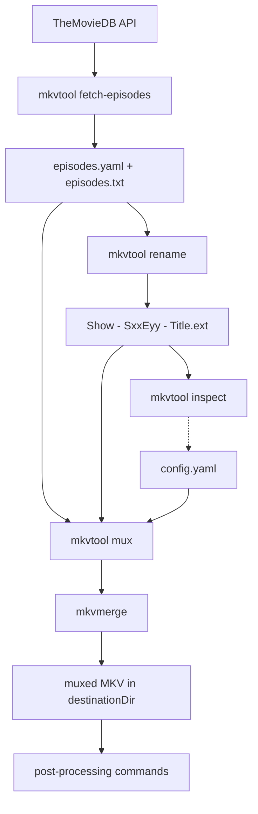

# mkvtool

[](https://github.com/vdenisov/mkvtool/actions/workflows/native.yml)
[](https://github.com/vdenisov/mkvtool/actions/workflows/ci.yml)
[](LICENSE)

A command-line tool for remuxing TV shows and movies with
[MKVToolNix](https://mkvtoolnix.download/). It grew out of the repetitive grind of
processing episodes with a large number of tracks: picking the right audio and
subtitle tracks, setting languages, titles and default flags, merging external
dubs and subtitles, and naming everything consistently.

It is deliberately narrow in scope — each subcommand does one thing, operates on
the current directory, and reports what it did rather than doing anything you did
not ask for.

```
mkvtool inspect --identify    # what tracks does this file have?
mkvtool inspect               # are all the episodes structured the same?
mkvtool mux --dry-run         # what would be muxed, exactly?
mkvtool mux                   # do it
```

## Installing

Every release attaches one archive per platform, each holding the binary, a short
readme and the license, flat with no directory to dig through:

| Platform | Asset |
|----------|-------|
| Windows x64 | `mkvtool-<version>-windows-x64.zip` |
| Linux x64 | `mkvtool-<version>-linux-x64.tar.gz` |
| macOS arm64 / x64 | `mkvtool-<version>-macos-arm64.tar.gz`, `mkvtool-<version>-macos-x64.tar.gz` |

Download yours from the
[releases page](https://github.com/vdenisov/mkvtool/releases), extract it, and put
`mkvtool` (`mkvtool.exe` on Windows) anywhere on your `PATH` — there is no runtime
to install alongside it, and the `.tar.gz` archives keep the executable bit, so no
`chmod` step either. Check with `mkvtool --version`.

`mkvtool-<version>-checksums.txt` is attached to the same release in `sha256sum`
format, covering every asset, so `sha256sum -c` verifies what you downloaded.

The Windows binary ships unsigned for now — a signature is in the works, and until
then the checksums above are how to verify what you downloaded. On macOS, an
archive downloaded in a browser carries the quarantine attribute;
`xattr -d com.apple.quarantine mkvtool` clears it. Each archive's own readme
repeats whichever of these applies to it.

The same release carries a fat jar, `mkvtool-<version>.jar`, for platforms without
a native build. It needs Java 21 or newer and runs as
`java -jar mkvtool-<version>.jar inspect --identify`; everything below applies to it
unchanged, except that each invocation needs the JVM to startup, and makes the
invocations slightly clunkier.

From a checkout:

```
./gradlew installDist     # a launcher in build/install/mkvtool/bin/
./gradlew shadowJar       # the fat jar in build/libs/
./gradlew nativeCompile   # the native binary in build/native/nativeCompile/ (needs a GraalVM JDK 21)
```

The native build also needs a C toolchain, and the project ships a container that has one along with
everything else it takes to build and test a binary — see
[docs/building.md](docs/building.md).

## Prerequisites

- **MKVToolNix** — `mkvmerge` is auto-detected from `PATH` (with a fallback to the
  default Windows install location); you can also set an explicit path in
  `config.yaml`. `mkvpropedit` (on `PATH`) is needed only by `filename-to-title`
  and `propedit`.
- A [TheMovieDB](https://www.themoviedb.org/) API key — only for
  `fetch-episodes`.
- **Java 21 or newer** — only if you run the fat jar rather than the native
  binary.

## Pipeline overview

The commands form a loose pipeline. Only `mux` is essential; everything else is
optional tooling around it.



## Commands

Every command operates on the current working directory — run it from the
directory holding your media files. `mux` reads `config.yaml` from that directory,
or from an explicit `--config <path>`; there is no fallback to a config anywhere
else, because silently applying some other directory's track selections is how you
get confidently wrong output.

`mkvtool` on its own prints the command list, and `mkvtool <command> --help`
documents one command's options.

| Command | Purpose |
|---------|---------|
| `mux` | The core muxer: builds and runs an `mkvmerge` command for every media file in the current directory, driven by `config.yaml`. `--dry-run` prints commands without running them, and file names or globs (plus `--exclude`) narrow the batch. |
| `inspect` | Looks at the files and reports; changes nothing and needs no config. The default run compares track structure across the batch, `--identify` prints a track table per file. |
| `fetch-episodes` | Fetches episode names for a show/season from TheMovieDB and writes `episodes.yaml` and `episodes.txt`. |
| `rename` | Batch-renames files to `Show - SxxEyy - Title.ext` using that metadata. |
| `filename-to-title` | Sets the MKV segment title and video track name to the file name (via `mkvpropedit`). |
| `propedit` | Batch-runs `mkvpropedit` over every MKV in the current directory, passing your arguments through — fix any property (track names, forced/default flags, …) without a full remux. |
| `to-utf8` | Converts `.srt`/`.ass`/`.ssa`/`.vtt` subtitles to UTF-8 in place, from `--encoding` (default Windows-1251). Skips files that are already UTF-8; `--backup` keeps the originals. |
| `fix-srt` | Converts subtitles in a non-standard timing format into valid SRT (writes `<name>.srt.fixed`). A malformed file is reported and skipped rather than stopping the batch. |
| `find-unused-fonts` | Lists font files in `fonts/` that are not referenced by any `.ass` subtitle in the current directory. |

### fetch-episodes

```
mkvtool fetch-episodes --show-id 2260 --season 1 [--api-key KEY]
mkvtool fetch-episodes --show-id https://www.themoviedb.org/tv/1920-twin-peaks/season/1
mkvtool fetch-episodes --show-id 1920 --season 1 --language ru-RU
```

`--show-id` takes either the numeric id or the show's URL, so the address can be
pasted straight from a browser. A URL that names a season supplies `--season`
too; passing a `--season` that disagrees with the URL is an error rather than a
silent choice between the two.

If `--api-key` is not supplied, the key is read from `apikey.txt` — the current
directory first, then `~/.mkvtool/apikey.txt` (`%USERPROFILE%\.mkvtool\apikey.txt`
on Windows), so the key does not have to be copied into every media directory.
Endpoint examples live in [`src/themoviedb.http`](src/themoviedb.http).

`--language` takes a TheMovieDB locale such as `ru-RU`, and the names are fetched
in that language. TheMovieDB answers an untranslated field with an empty string
rather than falling back on its own, so a partially translated season is topped
up from `en-US` and the command says when it did that.

Two files are written, both UTF-8, so non-Latin titles survive:

- **`episodes.yaml`** — the full metadata: show name, year, season number and
  name, and every episode by its real episode number. `mux` and `rename` both
  prefer it.
- **`episodes.txt`** — one episode name per line, the format that can be written
  by hand when there is no reason to involve the API at all.

Both files keep TheMovieDB's own spelling, punctuation included. The characters a
file name cannot hold (`\ / : * ? " < > |`) are dropped later by `rename`, when a
title actually becomes a file name; `mux` gets the full spelling for track and
segment titles.

A bad key, an unknown show or a nonexistent season prints TheMovieDB's own
message and exits 2 for a key problem, 3 for a network or API failure.

### rename

```
mkvtool rename                          # show name from episodes.yaml
mkvtool rename "Show Name" [episodeOffset]
mkvtool rename "Show Name" --dry-run    # preview, rename nothing
mkvtool rename "Show Name" --external   # rename the dubs and subs too
```

Renames every media/subtitle file whose name contains an `sXXeYY` pattern to
`Show Name - SXXEYY - <episode title>.<ext>`. A trailing `[suffix]` in the
original name (e.g. a dub studio tag) is preserved.

Titles come from `episodes.yaml` when it is present, and from `episodes.txt`
otherwise. The yaml carries real episode numbers, so a season with a gap in its
numbering stays aligned. The show name is also taken from `episodes.yaml`, which
makes the positional argument optional — pass it to override. This is also where
the characters a file name cannot hold are dropped, along with trailing dots and
spaces, since this is the point at which a title becomes a file name. It happens
on every platform, not only on Windows, so the same title produces the same file
name everywhere.

`episodes.txt` has no numbers in it, so it is matched by line order, and
`episodeOffset` (default 1) is the episode number of its first line. That exists
for the case it was invented for: a season downloaded in halves, where you fetch
titles for episodes 11–20 and `11` makes the first line mean E11.

**`episodeOffset` applies to `episodes.txt` only.** With `episodes.yaml` the
episode numbers are already real, so nothing is shifted and the argument is
ignored — passing the offset you would have needed for a trimmed `episodes.txt`
would otherwise put episode 1's title on E11, which looks entirely plausible and
is wrong.

The whole batch is checked before anything is renamed. If any file has no
`sXXeYY` pattern, has no matching title, or would overwrite an existing file or
collide with another rename, every problem is listed and nothing is touched.
This matters because renaming removes the `sXXeYY` pattern that ties a file to
its episode, so a rename that failed halfway would have to be untangled by hand.

#### Renaming external files too

External files — a dub under `Rus sound/[Studio]/`, a `.rus.srt` sibling — are
found by carrying the *main file's* base name. Renaming the episodes without them
therefore breaks exactly the relationship that made them findable, so `--external`
renames them along with their episode:

```
Show/
  S01E01.mkv                            -> My Show - S01E01 - Pilot.mkv
  S01E01.rus.srt                        -> My Show - S01E01 - Pilot.rus.srt
  Rus sound/[Studio]/S01E01.mka         -> Rus sound/[Studio]/My Show - S01E01 - Pilot.mka
```

Each file keeps its own suffix, verbatim, and stays in its own directory — the
directory is what identifies which dub group it belongs to, and nothing is
normalised or invented. Off by default: leaving external files alone is a
legitimate choice, and `mkvtool inspect` can still match them to their episodes by
episode number afterwards.

The whole-batch guarantee extends across the tree: if any file anywhere in it
would overwrite something, nothing is renamed at all. Files matched only by
episode number are reported and skipped, since their names carry no relation to
the main file's and so have no suffix to preserve.

`--dry-run` prints the planned `old -> new` pairs and exits; with `--external`
the left-hand side is the file's path, so it is clear which directory's copy is
being renamed.

### mux

```
mkvtool mux                          # check, then mux every matching file
mkvtool mux --dry-run                # print the mkvmerge command per file, run nothing
mkvtool mux "Show.S01E0[12].mkv"     # only the files matching a pattern
mkvtool mux --exclude "*.sample.mkv" # everything except the files matching a pattern
```

Reads `config.yaml` (see [Configuration](#configuration) below), discovers all
files in the current directory matching `allowedExtensions`, and runs `mkvmerge`
for each one. Output goes to `destinationDir`. If a file fails, the error is
printed and processing continues with the next file.

Titles in the config can be templates rather than fixed strings — see
[Substitution variables](#substitution-variables). To look at the files rather
than mux them — track tables, the batch structure report — use
[`inspect`](#inspect); it needs no config and changes nothing.

#### Selecting a subset of the files

Positional arguments narrow the batch to the files you name; `--exclude` drops
files from it. Both accept an exact file name or a glob, both may be repeated,
and both apply in every mode, `--dry-run` included. With no arguments the
behaviour is unchanged: every file in the directory. `inspect` takes the same
arguments.

```
mkvtool mux Show.S01E03.mkv                        # one file
mkvtool mux Show.S01E01.mkv Show.S01E03.mkv        # several files
mkvtool mux "Show.S01E*.mkv" --exclude "*.sample.mkv"
```

Quote your patterns so the behavior is identical across shells (globs are
expanded internally). A pattern that exactly names an existing file is taken
literally, so a file called `Odd[1].mkv` selects only itself rather than being
read as a character class. A pattern that matches nothing is reported, so a typo
does not look like a successful run with no work to do.

#### External file pre-flight

When `additionalSources` uses the `${fileName}` placeholder, every companion is
checked for existence before anything is muxed. Episodes whose companions are
missing are named and skipped; the rest of the batch is muxed normally.

```
*** 2 files will be skipped: companion files are missing
      ${fileName}[Studio].mka  (missing for 2 files)
        Show.S01E13.mkv, Show.S01E14.mkv
```

A dub or subtitle release covering only part of a season is routine. Without the
check that surfaces as an mkvmerge failure partway through a long batch; with it,
the gaps are visible before the first mux and the complete episodes still get
processed. Those episodes would have failed anyway, so nothing is lost by
skipping them — this never aborts the run. If every episode is blocked, the run
says so instead of printing a bare `Done`.

#### Pre-flight consistency check

Before muxing, the batch is compared for track-structure consistency — the same
report `inspect` prints, run here because a discrepancy at a selected track ID
means muxing the wrong dub into a whole season. Skip it with `--no-check`; make it
fatal with `--strict`, which exits 2 without muxing anything when a discrepancy
affects a track `config.yaml` selects. The report itself is documented under
[`inspect`](#inspect) below.

### inspect

```
mkvtool inspect                        # compare track structure across the batch
mkvtool inspect --identify             # print a track table per file
mkvtool inspect --identify --check     # both, from one scan
mkvtool inspect "Show.S01E0[12].mkv"   # only the files matching a pattern
```

Reports on the files and changes nothing — no output directory, no renames, no
remux. A `config.yaml` is optional: without one you get the structure of what is
there, which is what you read to *write* the config; with one, findings are also
classified against the tracks it selects and configured sources are resolved per
episode.

Nothing about a config can stop it. Missing, empty, malformed, or valid with a
typo in a template — each is reported and the run continues without it, because a
stale config in the directory should never stand between you and the track table,
least of all when reading that table is how you would fix the config. The exit
code is 0 unless you pass `--strict`.

#### External files

Dubs and subtitle variants usually do not sit next to the episodes — anime
releases put them in per-studio folders, TV releases use suffixed siblings. Both
are found by name, no config required, and grouped into **variants**: one dub
group, one subtitle group, one suffix.

```
*** External files: 3 variants discovered
  LBL  TYPE       VARIANT     PATTERN                         FILES
  A    subtitles  rus         <name>.rus.srt                  1
  B    audio      [MC-Ent]    Rus sound/[MC-Ent]/<name>.mka   4
  C    audio      [Омикрон]   Rus sound/[Омикрон]/<name>.mka  10
  C    subtitles  [Омикрон]   Rus subs/[Омикрон]/<name>.ass   10
```

Each episode's table then lists its own external files by label, so a long path
is printed once rather than under every episode:

```
  + [C] [Омикрон] (.mka, .ass)
  0    audio      AAC                    rus   no   no   Omikron dub
  0    subtitles  ASS                    rus?  -    -
```

Files that carry metadata mkvmerge can read (`.mka`, `.mks`, `.idx`, `.flac`) are
probed for it; the rest are described from their name, with the language guessed
from the folder or suffix and marked `rus?` so a guess is never mistaken for a
tag. Any spelling works — `Rus sound`, `Ru subs`, `Russian`, `Русский` — and an
untagged file (`und`) falls back to the guess rather than reporting nothing
useful. Files matched only by episode number, and files matching nothing at all,
are reported as such and never quietly paired up.

In the check report they are **part of the layout**, because they are part of a
muxing pass. Episodes with identical tracks but different dubs available are
different jobs, and the grouping says so — which is the question you actually
arrived with:

```
*** Layout 1 (6 files - episodes 05-10): video, audio, subs + B C E F
*** Layout 2 (4 files - episodes 01-04): video, audio, subs + A C E F
```

Two groups, two configs, and each says which episodes it covers — worked out from
the file names even when they carry no `SxxEyy`, as anime releases usually do not. `Track structure and external files are consistent
across 23 files` means one config does the whole season.

Discovery never feeds muxing: `mux` is driven by `additionalSources` and nothing
else. This is what you read in order to write those entries. Full rules —
matching, merging, what is probed — are in the
[reference](docs/reference.md#external-file-discovery).

`config.yaml` selects tracks by **numeric ID**, which quietly assumes every
episode in the directory has the same track layout. When that breaks — a
translation added mid-season, an old one dropped, a different release group
ordering tracks differently — mkvmerge does not complain; it muxes whatever sits
at that ID, and you discover the wrong dub at playback time.

The consistency check compares track structure across the whole batch. It is what
a bare `mkvtool inspect` run does, and `mux` runs the same report as its
pre-flight. No `config.yaml` is needed — so you can inspect a season's structure
before writing one — and with one present each finding is additionally classified
against the tracks it selects. `--check` and `--identify` can be combined; they
answer different questions and share one `mkvmerge` scan.

Files are first grouped by **track layout** — a shifted track order or a missing
track forms its own group — and the **values** at each ID (codec, language, name,
default/forced flags) are then compared within each group, one row per distinct
value:

```
*** Layout 1 (20 files): video, audio, subs
    ID   TYPE   CODEC                LANG  DEF  FOR  NAME
    0    video  AVC/H.264/MPEG-4p10  eng   yes  no   -
    1    audio  AC-3                 eng   yes  no   -
    2    subs   SubRip/SRT           eng   yes  no   English (SDH)
           <- Show.S01E16 - Episode Sixteen.mkv
    2    subs   SubRip/SRT           eng   no   no   English (SDH)

*** Layout 2 (2 files): subs, video, audio
              Show.S01E18 - Episode Eighteen.mkv
           <- Show.S01E20 - Episode Twenty.mkv
    ID   TYPE   CODEC                LANG  DEF  FOR  NAME
    0    subs   SubRip/SRT           eng   yes  no   -
    1    video  AVC/H.264/MPEG-4p10  eng   yes  no   -
    2    audio  AC-3                 eng   yes  no   English (SDH)

*** 1 discrepancy affects a track that config.yaml selects:
      2 files use a different track layout, at selected tracks 0, 1, 2
*** 1 informational (does not affect what gets muxed):
      track 2 (subtitles, config title "Signs") - default differs across 2 groups
```

- One row per distinct value, not per file — a 200-episode batch is as compact
  as a 3-episode one, and the differing cell is highlighted on a terminal.
- The `<-` lists name only the deviating files; the majority is the unnamed
  reference.
- With a `config.yaml` present, each difference is classified as **blocking**
  (it lands on a track the config selects) or informational.
- `--check-verbose` prints untruncated file lists; `--strict` exits 2 on any
  blocking discrepancy (in `mux` that also means nothing is muxed).

The full reading guide — what is compared and ignored, the exact
blocking-vs-informational rules, colours — is in the
[reference](docs/reference.md#reading-the-consistency-check-report).

`--identify` prints the track table you need in order to write the config — id,
type, codec, language, default/forced flags and track name for every track of
every matching file:

```
*** Show.S01E01.mkv
  ID   TYPE       CODEC                  LANG  DEF  FOR  NAME
  0    video      AVC/H.264/MPEG-4p10    und   no   no   Video
  1    audio      AAC                    jpn   yes  no   Audio A
  2    audio      AAC                    eng   no   no   Audio B
  4    subtitles  SubRip/SRT             eng   yes  no   Subtitle A
```

Nothing here writes anything: `inspect` has no output directory and never creates
one. (`mux --dry-run` is the equivalent for the command line itself — it prints
the exact `mkvmerge` invocation, which is the quickest way to check track
selection and `${fileName}` resolution before committing to a long mux. That
command is meant for reading, not pasting: mkvmerge's `(` and `)` source-grouping
tokens are not shell-safe as written.)

### propedit

```
mkvtool propedit --edit track:a2 --set flag-forced=0
```

Runs `mkvpropedit` against every `.mkv` in the current directory, passing all
arguments through verbatim with the file name inserted first. Anything
`mkvpropedit` accepts works, including options that look like `mkvtool`'s own:

```
mkvtool propedit --edit track:s1 --set flag-default=1
mkvtool propedit --edit info --set title="My Show"
mkvtool propedit --add-track-statistics-tags
```

Run with no arguments to print usage; nothing is modified. `-h`/`--help` is
handled locally only when it is the sole argument — in any other combination it
is passed through to `mkvpropedit`. Unlike `mux`, this command exits non-zero if
any file failed, so it can be used from a shell script.

### Post-processing utilities

```
mkvtool filename-to-title   # segment title + video track name := file name
mkvtool propedit            # batch mkvpropedit — fix properties without remuxing
mkvtool to-utf8             # subtitles → UTF-8, in place
mkvtool fix-srt             # repair non-standard SRT timing/markup
mkvtool find-unused-fonts   # report unreferenced fonts in fonts/
```

#### to-utf8

```
mkvtool to-utf8                          # from windows-1251 (the default)
mkvtool to-utf8 --encoding windows-1250  # from something else
mkvtool to-utf8 --backup                 # keep <name>.orig
mkvtool to-utf8 --dry-run                # report, write nothing
```

Converts `.srt`, `.ass`, `.ssa` and `.vtt` files in the current directory to
UTF-8, **in place**. The source encoding defaults to `windows-1251` and is always
printed, so it is never a silent assumption. The target is always UTF-8 — making
that configurable would defeat the command's purpose.

Pass `--backup` to keep the original as `<name>.orig`, or `--dry-run` to preview.

It is safe to point at a directory more than once: already-UTF-8 files are
skipped, decoding is strict (a wrong `--encoding` is refused rather than quietly
producing mojibake), UTF-16 input is left alone, `.sub` files are deliberately
excluded, and line endings survive conversion. The full rationale is in the
[reference](docs/reference.md#to-utf8-safety).

## Configuration

`mux` is driven by a YAML configuration file — `config.yaml` in the media
directory, or `--config <path>`. Quick start:

1. Copy [`src/config.example.yaml`](src/config.example.yaml) next to your media
   files as `config.yaml`.
2. Run `mkvtool inspect --identify` to see each file's track IDs.
3. Keep the tracks you want, delete the rest:

```yaml
general:
  destinationDir: "mkv"           # output goes here
  allowedExtensions: ["mkv"]

mainSource:
  videoTrack:
    language: "ja"                # title defaults to the file name
  audioTracks:
    - id: 1                       # ID from inspect --identify
      language: "ja"
      title: "Japanese"
      default: true
  subtitleTracks:
    - id: 4
      language: "en"
      title: "English"
      default: true
```

Omitting `audioTracks` or `subtitleTracks` copies no tracks of that type, and
the output track order is derived from the config unless you set `trackOrder`
explicitly. Every field — including `additionalSources` for merging external
dubs and subtitles with per-episode `${fileName}` resolution — is covered in
the [configuration reference](docs/reference.md#configuration).

## Substitution variables

Titles and companion paths in `config.yaml` are templates. Instead of writing
one static string per season, write what the value is made of:

```yaml
general:
  title: "${showName} - S${seasonNum}E${episodeNum} - ${episodeName}"

mainSource:
  videoTrack:
    title: "Original Japanese"        # the video track's own name
  audioTracks:
    - id: 1
      language: "ru"
      title: "${languageNative} ${codec}"      # "Русский DTS"
  subtitleTracks:
    - id: 4
      language: "en"
      title: "${languageName} ${codec}"        # "English SRT"
```

**File-scope variables** describe the episode and are valid in every templated
field:

| Variable | Example | Comes from |
|---|---|---|
| `fileName` | `Show - S01E02 - Title` | the file being muxed |
| `extension` | `mkv` | the file being muxed |
| `showName` | `Twin Peaks` | `episodes.yaml`, else the canonical file name |
| `seasonNum` | `01` | the `SxxEyy` in the file name, else `episodes.yaml` |
| `episodeNum` | `02` | the `SxxEyy` in the file name |
| `episodeName` | `Traces to Nowhere` | `episodes.yaml` / `episodes.txt`, else the canonical file name |
| `seasonName` | `Season 1` | `episodes.yaml` |
| `showYear` | `1990` | `episodes.yaml` |

**Track-scope variables** describe one track and are valid only in a track's
`title`:

| Variable | Example | Comes from |
|---|---|---|
| `language` | `ru` | that track's `language` in the config |
| `languageName` | `Russian` | the JDK's language data |
| `languageNative` | `Русский` | the JDK's language data, capitalized |
| `codec` | `DTS`, `SRT`, `H.264` | the actual track, via `mkvmerge -J` |

Because `episodeName` comes from `episodes.yaml` rather than from the file name,
it keeps the characters a file name cannot hold — an episode really called
`Zen, or the Skill to Catch a Killer: Part 2?` is spelled that way in the title
even though the file on disk is not.

The segment (container) title and the video track name are separate fields.
`general.title` sets the first, `mainSource.videoTrack.title` the second; each
defaults to the file name independently. Players disagree about which of the two
they display, and some label one with the other's name — so if you are unsure
what yours reads, setting both to the same value is the safe option.

**A misspelled variable is an error, not a literal.** Every template is checked
before anything is probed or muxed, in every mode, and an unknown name — or a
track variable used in a file-scope field — exits 2 naming the offending field:

```
*** Error: config.yaml has 1 substitution problem:
  mainSource.audioTracks[0].title: ${languagName}
      valid here: codec, episodeName, episodeNum, extension, fileName, ...
```

A variable that is valid but has *no data for one particular episode* is a
different matter: those episodes are reported and dropped, and the rest of the
batch is muxed, the same way a missing companion file is handled. `--strict`
turns that into an abort as well.

There is no escape syntax, so a literal `${...}` cannot currently be written in
a title. The check report prints templates unresolved, on purpose: it runs
across the whole batch and identifies *which config entry* a finding refers to.

## Tests

Two tiers, and they answer different questions. The unit tier is in-process and
fast, and needs neither MKVToolNix nor the network:

```
./gradlew test
```

The acceptance tier is the Groovy suite under `src/test/`. It runs the real thing
as a subprocess against real MKV fixtures, and it is the specification the port
was built against — the same cases run against the v1 scripts and against the
binary, and both must answer identically:

```
groovy src/test/run_tests.groovy --target app     # the binary (installDist by default)
groovy src/test/run_tests.groovy                  # the v1 scripts
groovy src/test/run_tests.groovy --target app --app-bin build/native/nativeCompile/mkvtool
groovy src/test/run_tests.groovy --target app --app-bin build/jar-launcher/mkvtool
groovy src/test/run_tests.groovy --filter 01 --keep
```

`--app-bin` takes any executable, which is how one suite covers three packagings:
the `installDist` launcher, the native binary, and the fat jar through the small
launcher `./gradlew jarLauncher` writes for it.

It needs `mkvmerge` (auto-detected from PATH, or `--mkvmerge-exe`) and Groovy 3
or newer. Cases that need `mkvpropedit`, or a bare `groovy` on `PATH` for the
wrapper smoke test, skip themselves with a printed note when those are
unavailable. Run only one suite at a time: work directories are keyed by case
name, so a second run wipes the first one's fixtures mid-test.

## Under the hood

If you are curious about the details — the output and colour conventions, the
full guide to reading the consistency check report, `to-utf8`'s safety rationale,
and the complete `config.yaml` field reference — they live in
[docs/reference.md](docs/reference.md).

## The Groovy scripts (v1)

This started as nine separate Groovy scripts, one per command, and they are still
in the tree — `src/*.groovy`, the shared code in `src/lib/`, and a wrapper pair
each in `bin/`. They are frozen: the binary reproduces their behaviour, all new
work happens in it, and the scripts will be deleted once it has a release of
overlap behind it. Nothing above needs them.

If you are moving over from them, the v2.0.0 release notes carry the mapping and
the handful of differences. Running a script still needs Java 11 or newer, Groovy
3 or newer, and network access on first run for `@Grab`.

## License

[MIT](LICENSE)
